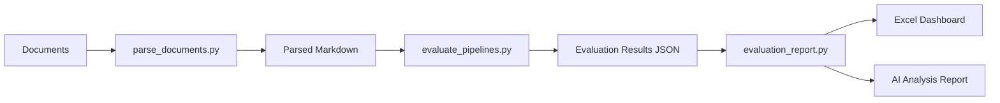

# Evaluation Report Generator

This script generates comprehensive evaluation reports for document parsing pipelines, including metrics analysis, Excel dashboards with charts, and AI-powered insights.

## Overview

The `evaluation_report.py` script analyzes the results from `evaluate_pipelines.py` and produces:

1. **Excel Dashboard** (`evaluation_report_TIMESTAMP.xlsx`) with:
   - Global Summary sheet with overall metrics
   - Pipeline Comparison sheet with performance by pipeline
   - Detailed Results sheet with all evaluation data
   - Verdict Distribution pivot table
   - Pie chart showing overall verdict distribution
   - Bar chart comparing pipeline success rates

2. **AI Analysis Report** (`ai_analysis_report_TIMESTAMP.md`) with:
   - Executive summary with key findings
   - Methodology assessment
   - Performance analysis comparing pipelines
   - Root cause analysis of failures
   - Production recommendations
   - Detailed findings by verdict type

## Requirements

The script requires the following dependencies (already added to `pyproject.toml`):

```
pandas>=2.2.0
openpyxl>=3.1.0
google-genai>=1.39.0
langfuse>=3.5.1
openinference-instrumentation-google-genai>=0.1.5
```

## Usage

### Running the Script

```bash
cd backend/explorations/parsers/parsers_evaluation
uv run python evaluation_report.py
```

### Prerequisites

1. Ensure you have parsed documents using `parse_documents.py`
2. Run `evaluate_pipelines.py` to generate evaluation results in `output/evals/`
3. Have valid Google Cloud credentials configured (for Gemini API)

### Output Files

Both output files are saved in `reports/` with timestamps:

- `evaluation_report_20250930_002007.xlsx` - Excel dashboard
- `ai_analysis_report_20250930_002007.md` - AI analysis report

## Key Features

### Metrics Computed

#### Global Metrics
- Total evaluations
- Count and rate of each verdict type (CORRECT, PARTIAL, HALLUCINATION, MISSED)
- Average confidence score
- Overall success rate (CORRECT + PARTIAL)

#### Pipeline Metrics
- All metrics above, grouped by pipeline
- Allows comparison of different parsing approaches

### Excel Dashboard Features

The Excel file includes multiple sheets for drill-down analysis:

1. **Global Summary**: Overall performance with verdict distribution pie chart
2. **Pipeline Comparison**: Side-by-side metrics with success rate bar chart
3. **Detailed Results**: Full evaluation data for investigation
4. **Verdict Distribution**: Pivot table showing verdicts by pipeline

### AI Analysis

The script uses Gemini 2.5 Flash with an **extended thinking budget of 8192 tokens** to generate a comprehensive report covering:

- Performance patterns and trends
- Root cause analysis of failures
- Production deployment recommendations
- Hybrid approach suggestions
- Future evaluation directions

## Architecture

The script follows modular design principles:

```
load_evaluation_results()
    └── Loads all JSON files from output/evals/

compute_global_metrics()
    └── Calculates overall performance metrics

compute_pipeline_metrics()
    └── Calculates per-pipeline metrics with pandas

create_detailed_results_df()
    └── Creates detailed DataFrame for drill-down

write_excel_with_charts()
    ├── Writes multiple sheets to Excel
    ├── add_global_pie_chart()
    └── add_pipeline_bar_chart()

generate_ai_report()
    └── Uses Gemini with extended thinking for analysis

generate_full_report()
    └── Orchestrates the entire report generation process
```

## Example Output

### Console Output

```
Loading evaluation results...
Loaded 9 evaluation results

Computing metrics...

Global Metrics:
{
  "total_evaluations": 9,
  "correct_count": 3,
  "partial_count": 2,
  "hallucination_count": 1,
  "missed_count": 3,
  "correct_rate": 0.3333,
  "partial_rate": 0.2222,
  "hallucination_rate": 0.1111,
  "missed_rate": 0.3333,
  "avg_confidence": 1.0,
  "success_rate": 0.5556
}

Pipeline Metrics:
      pipeline_name  verdict_total  correct_rate  success_rate
0       extend_solo              3        0.3333        0.6667
1  mistral_ocr_solo              3        0.3333        0.3333
2  pymupdf4llm_solo              3        0.3333        0.6667

Generating Excel report: reports/evaluation_report_20250930_002007.xlsx
✓ Excel report saved

Generating AI analysis report (this may take a minute)...
✓ AI report saved

============================================================
Report generation complete!
============================================================
```

### Sample AI Insights

The AI report provides actionable insights like:

> **`extend_solo` and `pymupdf4llm_solo` demonstrated superior robustness (66.7% success rate)** 
> and mitigated the severe risk of hallucination compared to `mistral_ocr_solo`. 
> We recommend basing future development and production deployment on either 
> `extend_solo` or `pymupdf4llm_solo`, while urgently prioritizing improvements 
> in table cell extraction fidelity.

## Related Files

- `parse_documents.py` - Parses documents with different pipelines
- `evaluate_pipelines.py` - Evaluates parsing quality using Q&A approach
- `parsing_pipelines/` - Individual pipeline implementations

## Workflow



## Notes

- The script is optimized for exploration and analysis, not production deployment
- Extended thinking budget provides deeper AI insights at the cost of longer generation time
- Excel charts are automatically positioned for easy viewing
- All metrics are computed with proper error handling for empty datasets
